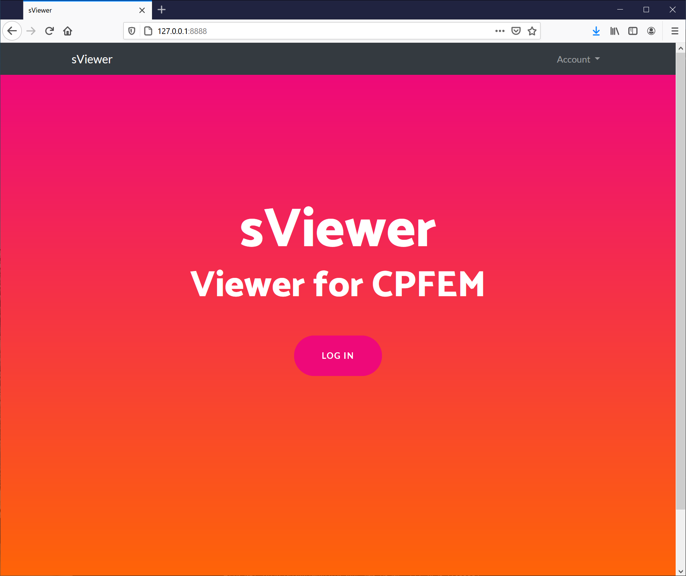
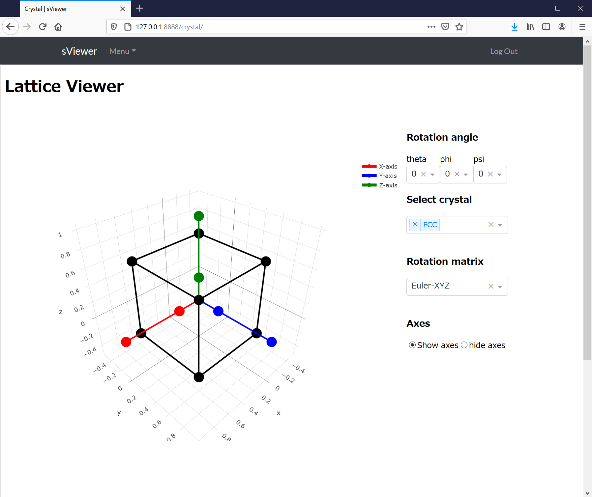
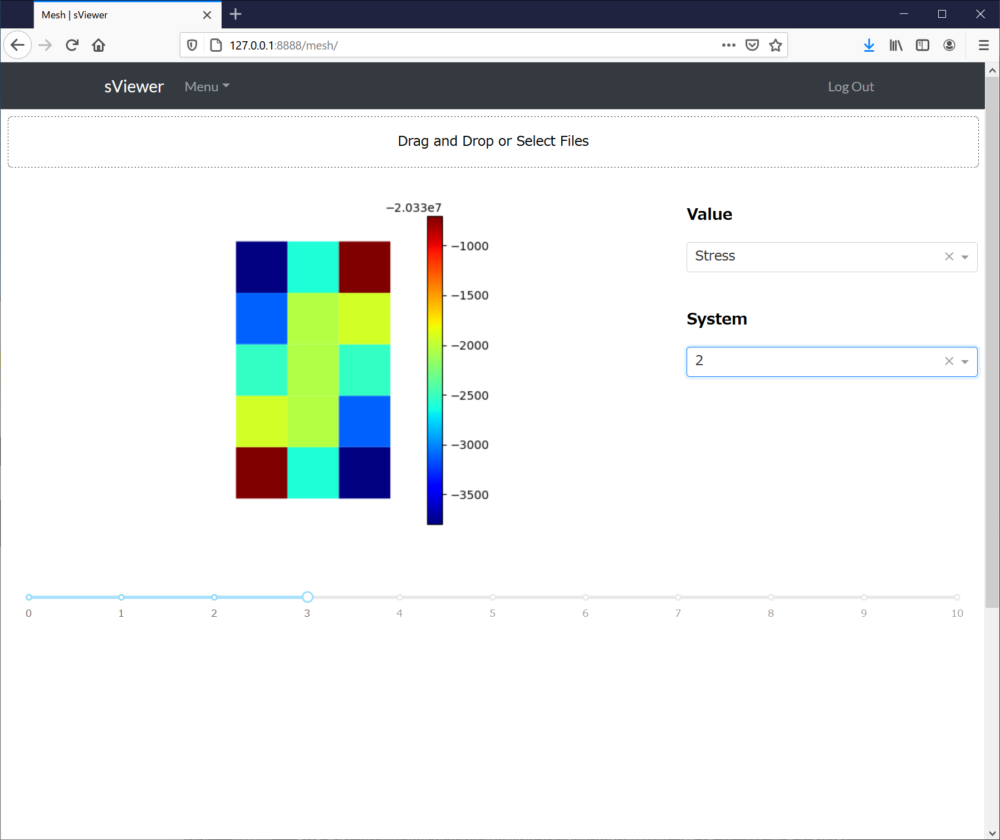

# sViewer
Simple viewer for CPFEM

## Usage
```bash
$ docker-compose -f docker-compose.prod.yml up -d --build
$ docker-compose -f docker-compose.prod.yml exec web python manage.py migrate --noinput
$ docker-compose -f docker-compose.prod.yml exec web python manage.py collectstatic --no-input --clear
```

## Screenshots

| Top page | Lattice viewer | Vtk viewer |
|:---:|:---:|:---:|
|  |  |  |
